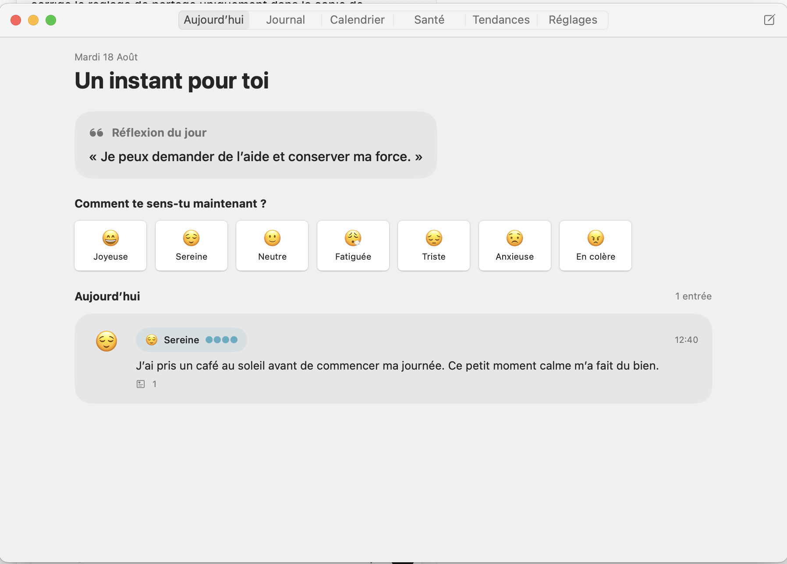
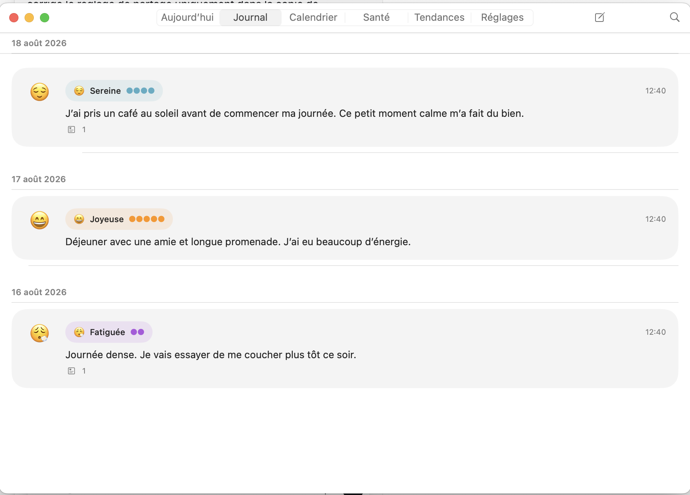
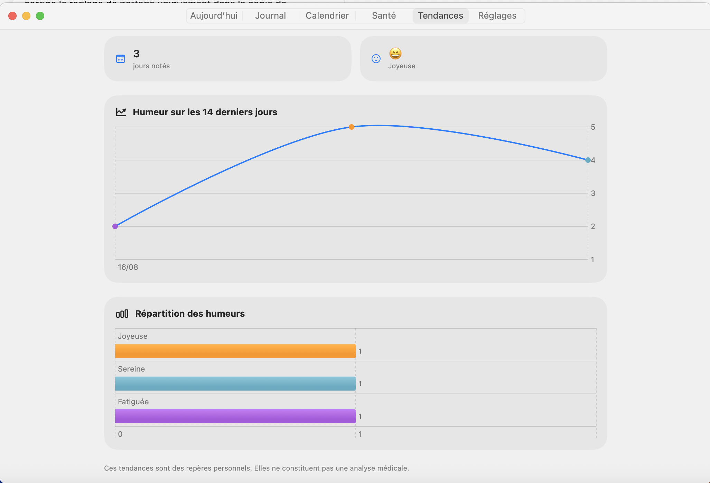

# Éclat Journal

> Un journal de bien-être multimédia, privé et local-first, pour les petits moments de la vie.

[Read in English](README.md) · [Feuille de route](ROADMAP.md) · [Journal des changements](CHANGELOG.md) · [Confidentialité](PRIVACY.md) · [Avertissement santé](MEDICAL_DISCLAIMER.md) · [Contribuer](CONTRIBUTING.md)

Éclat Journal est une application SwiftUI native pour iOS et macOS. Son MVP fonctionnel offre un espace calme pour consigner son humeur, ses mots et ses médias, sans compte et sans envoyer le journal vers un serveur exploité par le projet.

Le projet est en début de développement public. Son intention est simple : un journal personnel attentionné, et non un réseau social, un outil de diagnostic ou une application conçue pour capter l'attention.

## Aperçu

Les captures ci-dessous n’utilisent que des données fictives : aucune donnée de journal ou de santé personnelle n’y apparaît.

  

  

  

## L'idée

Une journée ne se résume pas toujours à une seule entrée. Éclat Journal permet de faire plusieurs petits points au fil du temps :

- choisir une humeur par emoji et, si souhaité, son intensité ;
- ajouter quelques mots ou une réflexion plus longue pour donner du contexte ;
- importer et lire des photos, fichiers audio et courtes vidéos ;
- noter un symptôme, une prise de médicament, un dosage ou un ressenti personnel ;
- retrouver une journée dans le calendrier et la frise chronologique, puis observer des tendances simples ;
- commencer la journée avec un mantra original choisi hors ligne depuis une collection intégrée à l'application.

Les notes liées à la santé servent uniquement à la tenue d'un dossier personnel. Éclat Journal ne fournit ni conseil médical, ni diagnostic, ni traitement, ni assistance d'urgence. Consultez l'[avertissement santé](MEDICAL_DISCLAIMER.md).

## Une confidentialité pensée dès le départ

- Les métadonnées du journal sont conservées localement avec SwiftData ; les médias importés sont stockés dans l'espace local de l'application.
- La première version n'exige aucun compte et n'intègre ni publicité, ni SDK d'analytique, ni service IA distant, ni serveur exploité par le projet.
- Les mantras sont inclus dans l'application : le contenu du journal n'a pas à être envoyé à une IA.
- Toute future synchronisation ou fonction d'export devra être explicite, documentée et activée volontairement.

« Local » ne veut pas dire « sans risque ». Les sauvegardes de l'appareil, les appareils partagés, les exports manuels et l'emplacement d'origine d'un média peuvent avoir des conséquences sur la confidentialité. Lisez [PRIVACY.md](PRIVACY.md) avant d'y consigner des informations sensibles.

## Plateformes et technologies

| Domaine | Choix |
| --- | --- |
| Plateformes | iOS 17+ et macOS 14+ |
| Interface | SwiftUI |
| Persistance | SwiftData |
| Import de photos et vidéos | PhotosUI et Transferable |
| Import audio | Sélecteur de fichiers SwiftUI et UniformTypeIdentifiers |
| Lecture des médias | AVKit |
| Tendances | Swift Charts |
| Langue de l'interface | Français |

L'application ne dépend d'aucune bibliothèque tierce à l'exécution.

## Structure du projet

~~~text
EclatJournal/
├── App/           Point d'entrée, navigation, ModelContainer
├── Domain/        Modèles et règles métier
├── Features/      Accueil, Journal, Chronologie, Santé, Tendances, Réglages
├── Media/         Import, stockage local et lecture
└── Support/       Formatage des dates et données fictives
~~~

Les principaux modèles sont JournalEntry, Mood, MediaAttachment, HealthEvent, DailyMantra et JournalInsights. Les tendances sont calculées à partir des données locales ; elles ne sont pas un outil de diagnostic.

## Lancer le projet

Pré-requis : macOS et une version actuelle de Xcode prenant en charge iOS 17 et macOS 14.

~~~sh
git clone https://github.com/YOUR_GITHUB_USERNAME/EclatJournal.git
cd EclatJournal
open EclatJournal.xcodeproj
~~~

Sélectionnez le schéma Éclat Journal, puis une destination iOS ou My Mac.

Les tests macOS peuvent être exécutés sans simulateur iOS :

~~~sh
xcodebuild \
  -project EclatJournal.xcodeproj \
  -scheme EclatJournal \
  -destination 'platform=macOS' \
  test
~~~

## Feuille de route

- [x] Fondations : application SwiftUI partagée, données locales, mantra quotidien hors ligne
- [x] Journal : plusieurs entrées quotidiennes, humeur, texte, calendrier et frise
- [x] Médias : import et lecture de photos, fichiers audio et courtes vidéos, avec nettoyage local
- [x] Santé : symptômes, médicaments et contexte personnel
- [x] Tendances : répartition locale des humeurs, jours actifs et courbe sur 14 jours
- [ ] Finition : accessibilité, permissions, export, verrouillage biométrique optionnel, widgets et localisation
- [ ] Plus tard : synchronisation iCloud explicitement choisie et documentée

Hors périmètre : diagnostic, recommandations de traitement, partage automatique de données de santé, publicité, tracking comportemental et traitement cloud caché.

## Contribuer

Les contributions et retours sont les bienvenus. Consultez [CONTRIBUTING.md](CONTRIBUTING.md), respectez le [Code de conduite](CODE_OF_CONDUCT.md) et utilisez [SECURITY.md](SECURITY.md) pour signaler une vulnérabilité de manière responsable.

Ne versez jamais de véritables entrées de journal, données de santé, photos, enregistrements, vidéos, clés API ou autres données personnelles dans ce dépôt.

## Licence

Éclat Journal est distribué sous [licence MIT](LICENSE).
